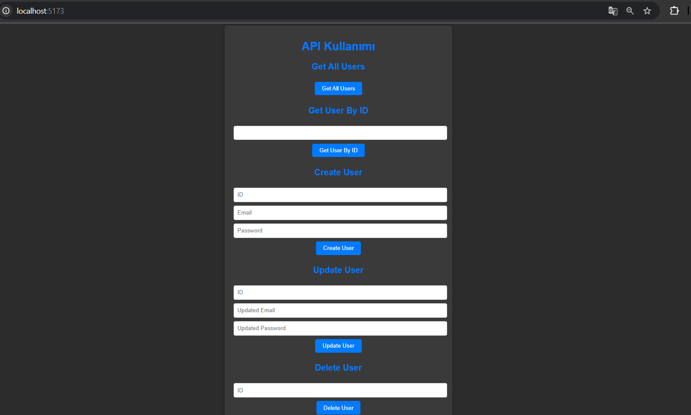

# 🚀 React ile API İstekleri Yönetimi

Bu proje, React uygulamasında API isteklerinin nasıl yönetileceğini gösteren basit bir örnek uygulamadır. Axios kütüphanesi kullanılarak GET istekleri gerçekleştirilmiştir.



## 🛠️ Kurulum ve Çalıştırma

```bash
# Projeyi klonlayın
git clone [https://github.com/kadirn7/API-UsingReact]

# Proje dizinine gidin
cd API-Using

# Bağımlılıkları yükleyin
npm install

# JSON Server'ı başlatın
json-server --watch src/db.json --port 3000

# Yeni bir terminal açın ve React uygulamasını başlatın
npm run dev
```

## 📋 Özellikler

- Tüm kullanıcıları listeleme
- ID'ye göre kullanıcı getirme
- JSON Server ile mock API kullanımı
- Yeni kullanıcı oluşturma
- ID'ye göre kullanıcı güncelleme
- ID'ye göre kullanıcı silme

## 🔍 API Endpoints

| Endpoint | Açıklama |
|----------|----------|
| GET /users | Tüm kullanıcıları getirir |
| GET /users/:id | ID'ye göre kullanıcı getirir |
| POST /users | Yeni kullanıcı oluşturur |
| PUT /users/:id | ID'ye göre kullanıcı günceller |
| DELETE /users/:id | ID'ye göre kullanıcı siler |

## 🛠️ Kullanılan Teknolojiler

- React
- Axios
- JSON Server
- Vite

## 📝 Önemli Notlar

- JSON Server'ın çalışması için `db.json` dosyasının `src` klasörü içinde olduğundan emin olun
- API istekleri için varsayılan port: 3000
- React uygulaması varsayılan port: 5173

## 📜 Lisans

MIT © [2024]
